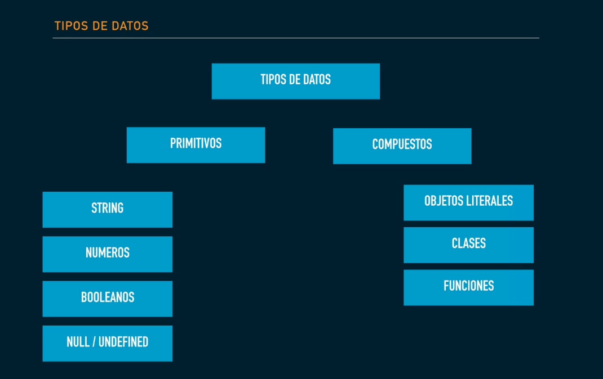

 # Intro TS

- Es un super set de JS
- compilar através del CLI 

```js
$ tsc fileName.ts
```

Crear un archivo de configuración de tsc
```js
$ tsc --init
```

**watch mode** modo listener
 ```js
$ tsc --watch
```

Modo watch para más archivos
```js
$ tsc *.ts -w
```

Excluir archivos, en tsc.config
```js
{
  "exclude":["fileName"]
}
```

### Tipos de datos




**Template Literals**
```js
`${nombre}`
`${edad + 10}` // imprime la suma
```

# Funciones

### Parámetros 
- Parámetros obligatorios, opcionales, por default. En ese orden

```js
function getInfo(name: string, edad?: number ,apellido: string = 'Lopez'){

}

getInfo('Sofia')
```

### Funciones flecha

Functions declarations and function expression (stored on a variable)

```js
const x = (a:number, b:number) => a + b;
```

- Las funciones flecha no modifican el scope del this, a diferencia de una funcion es5

### Destructuring

- Desestructuración en los parámetros de la función

**Object Destructuring**
```js

const person = {
  name: 'Sofia',
  age:30
}

const extract = ({name, age}: any) {
  congole.log(name);
  congole.log(any);
}

extract(person);

```

**Array Destructuring**
```js
const nameArr = ['Sofia','Frida','Brenda'];

const extraerName = ([sof, frimemu, bren]:string[]){

};

extraerArr(nameArr);
```

# Promesas

Ejecutar un código no bloqueante

```js
const retirarDinero = ( montoRetirar: number ): Promise<number> => {
  let dineroActual = 1000;

  // Me va a retornar un resolve(dineroActual) o un reject('No hay suficientes montos');
  return new Promise((resolve, reject) =>{
    if( montoRetirar > dineroActual){
      reject('No hay suficientes montos');
    }else{
      dineroActual -= montoRetirar;
      resolve(dineroActual)
    }
  });

}

retirarDinero(500)
  .then(montoActual => console.log(`Me queda ${montoActual}`))
  .catch(console.warn(err))

```